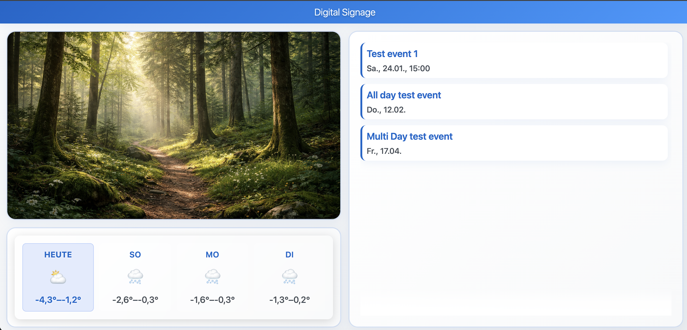
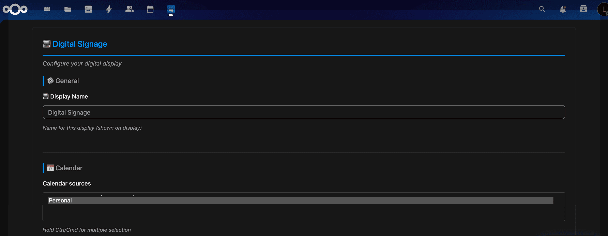
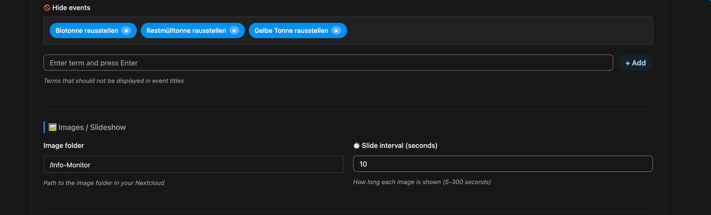
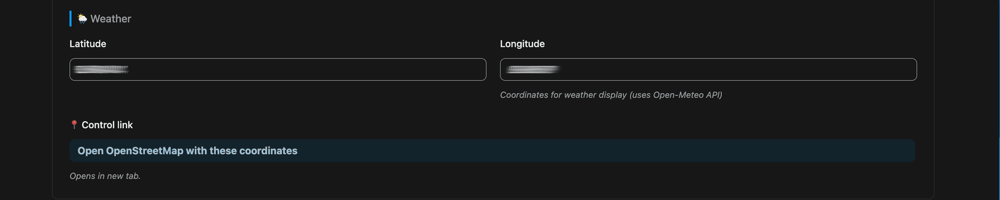
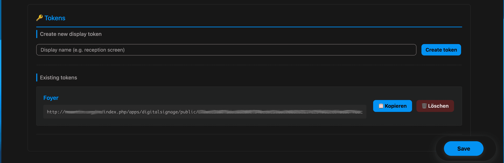

# Digital Signage for Nextcloud

A Nextcloud app for displaying digital info monitors with calendar events and media slideshows.

Short App Store summary: Public information screens for Nextcloud with calendars, event descriptions, weather, media slideshows (images & videos), presets and remote switching.



## Features

- **Calendar integration**: Display upcoming events from multiple Nextcloud calendars
- **Event descriptions**: Optionally show sanitized calendar descriptions below events, limited to three lines
- **Preset-based slideshow control**: Switch media folder, crop mode, playback order, interval, fullscreen slideshow mode and display name visibility via presets
- **Preset widget selection**: Enable or disable the slideshow, weather and calendar independently for each preset
- **Adaptive widget layouts**: Automatically give the remaining widgets the available space; weather is displayed in a narrow vertical column when paired with the slideshow or calendar
- **Media slideshow**: Automated slideshow from a Nextcloud folder with images (JPG, PNG, GIF, WebP) and videos (MP4, WebM, MOV, MKV)
- **Video playback**: Native HTML5 video support with muted autoplay and auto-advance to next item after video ends
- **Fullscreen mode**: One-click fullscreen toggle with optional auto-prompt on page load
- **Flexible layout and appearance**: Configure slideshow width, colors and per-text-class font sizes
- **Smart event filtering**: Autocomplete-enabled event exclusion based on actual calendar titles
- **Weather information**: Real-time weather data and icons from Nextcloud Weather Status
- **Display and control tokens**: Separate public view token and control token per display
- **Remote preset switching**: Activate presets through the control API without opening the settings UI
- **Multi-language support**: English, German (informal/formal), French, Dutch, Spanish and Italian translations
- **Configurable settings**: Global display settings plus per-display preset assignment through the UI

See [CHANGELOG.md](CHANGELOG.md) for all release notes.

## Installation

### Requirements

- Nextcloud 24–34
- PHP 7.4 or higher

### Installing in Nextcloud

1. Download the app from the Nextcloud App Store

2. Or clone the app into your Nextcloud `apps/` folder:

   ```bash
   cd /path/to/nextcloud/apps/
   git clone https://github.com/lmaertin/nextcloud-digitalsignage.git
   ```

3. Enable the app in Nextcloud settings or via CLI:
   - UI: **Settings** > **Apps** > "Digital Signage" > **Enable**
   - CLI: `php occ app:enable digitalsignage`

### Configuration

1. Open the **Digital Signage** app in Nextcloud (App overview) – settings are integrated directly on the app page.

2. Configure the following settings (via UI, no file edits needed):

   **Global Display Settings:**
      - **Display Name**: Global title shown at the top of displays (visibility controlled per preset)
      - **Auto-prompt for fullscreen**: When enabled, displays an optional dialog asking users to activate fullscreen mode when opening the display
      - Useful for kiosk setups and dedicated display devices
      - Can be declined without affecting functionality
      - **Slideshow width in percent**: Controls how much width the image area uses in the standard split layout; the remaining space is used by calendar and weather

   **Color Customization:**
   - **Primary Color**: Main accent color for UI elements
   - **Background Color**: Display background color
   - **Text Color**: Color for event and information text
   - **Gradient Start/End**: Header gradient colors for title bar
   - Colors can be reset to defaults with one click

   **Content Sources:**
   - **Calendar Sources**: Select multiple calendars from your Nextcloud calendars
   - **Text Sizes**: Configure display, clock, weather and calendar typography per text class

   **Event Filtering:**
   - **Hide Events**: Exclude specific events by title using autocomplete suggestions
   - Autocomplete shows actual event titles from your configured calendars
   - Add multiple exclusion terms as tags

   **Weather:**
   - Weather location and temperature unit are taken from the user's Nextcloud Weather Status settings

   **Media / Slideshow Presets:**
   - **Preset Name**: Administrative name for the preset
   - **Media Folder**: Select folder from your Nextcloud file tree (for example `/Photos/Info-Monitor` or `/Media/Signage`)
   - Supports images (JPG, PNG, GIF, WebP) and videos (MP4, WebM, MOV, MKV)
   - **Crop Mode**: Choose whether media fills the area or is fully contained with background
   - **Playback Order**: Shuffle media files or play them in ascending filename order
   - **Slide Interval (seconds)**: Duration per image in slideshow (videos play to completion automatically)
   - **Fullscreen Slideshow Mode**: Hide calendar, weather and clock and show media only
   - **Show display name in header**: Control whether the configured display name appears at the top of the screen for this preset
   - **Widgets**: Choose whether the slideshow, weather and calendar are shown; at least one widget must remain enabled
   - **Event descriptions**: Choose whether calendar event descriptions are shown for this preset; descriptions are limited to three visible lines
   - **Header title**: Choose whether the global display name, the preset name or no title is shown in the display header

   **Displays:**
   - **Create new display** creates a dedicated screen entry with its own public view token and control token
   - **Internal display label** is only used to distinguish displays in the admin UI
   - Each display has a **view token** for the public screen URL
   - Each display has a **control token** for remote preset switching
   - Each display can be assigned an active preset

3. Save the settings





## Usage

### Creating a Display

1. Open the Digital Signage app in Nextcloud
2. In the **Displays** section, enter an internal label (for example, "Entrance Monitor")
3. Click **Create Display**
4. Copy the generated view URL and open it on your display device (kiosk mode recommended)
5. Optionally copy the control token for remote preset switching
6. Select the active preset for that display in the admin UI



### Display View

The public display URL opens a full-screen view without login. This can be opened on a Raspberry Pi, Android tablet, or other device in kiosk mode.

In the default layout, the slideshow and the calendar/weather area share the screen using the configured slideshow width percentage. Changes to the active preset or the display layout config are picked up automatically by connected displays.

When widgets are disabled in a preset, the public display adapts automatically:

- **Slideshow only**: Uses the full available height and width
- **Weather only or calendar only**: Uses the full available display area
- **Slideshow and weather**: Slideshow uses the larger area and weather is shown in a narrow vertical column
- **Slideshow and calendar**: Uses a two-column layout
- **Weather and calendar**: Weather uses a narrow vertical column and calendar receives the remaining space
- **All widgets**: Uses the standard slideshow, weather and calendar layout

On small or portrait displays, the layout falls back to a vertical arrangement with internal scrolling where necessary.

**Fullscreen Features:**

- **Manual Toggle**: Click the fullscreen button (⛶) in the top-right corner of the header to enter/exit fullscreen mode
- **Auto-prompt**: If enabled in settings, a dialog will appear asking to activate fullscreen mode when the page loads
- **Keyboard Shortcut**: Press `ESC` to exit fullscreen mode
- **Browser Compatibility**: Works in Chrome, Firefox, Safari, and Edge with webkit prefix support

**Kiosk Mode Tips:**

- Enable "Auto-prompt for fullscreen" in settings for automatic fullscreen activation
- Use browser kiosk mode for dedicated displays (e.g., `chromium-browser --kiosk --app=URL`)
- Fullscreen button auto-hides after 5 seconds of inactivity and reappears on mouse movement

### Presets and Displays

- **Global settings** define shared display behavior such as title, colors, calendars, weather, and text scaling.
- **Layout settings** define how much horizontal space the image area gets in the standard split view.
- **Presets** define image and widget behavior such as folder, crop mode, playback order, interval, fullscreen slideshow mode, display name visibility, and widget selection.
- **Displays** combine a public view URL, a control token, and one active preset.

This separation makes it possible to keep common settings global while switching display modes remotely.

## App Store Meta

- Name: Digital Signage
- Summary: Public information screens for Nextcloud with selectable calendars, weather, media slideshows, presets and remote switching.
- Highlights:
   Selectable calendar, weather and slideshow widgets on public displays without login; presets for widget and slideshow behavior; per-display view and control tokens; configurable layout, colors and text sizes.

## Development

### Local Development

```bash
# Clone Repository
git clone https://github.com/lmaertin/nextcloud-digitalsignage.git
cd digitalsignage

# Configure Git hooks (required for pre-commit checks)
git config core.hooksPath .githooks

# Create symlink in Nextcloud
ln -s $(pwd) /path/to/nextcloud/apps/digitalsignage

# Enable in Nextcloud
cd /path/to/nextcloud
php occ app:enable digitalsignage
```

### Pre-Commit Hooks

Before committing, the following checks are automatically executed:

1. **PHP Syntax Check** - validates all PHP files for syntax errors
2. **PHPUnit Tests** (optional) - runs unit tests if Docker container is available

The pre-commit hook requires:

- PHP CLI (always required)
- Docker and Nextcloud container (optional, tests will be skipped if unavailable)

To skip the hooks (not recommended):

```bash
git commit --no-verify
```

### Database Schema

- No manual database setup required.
- When enabling or updating the app, Nextcloud automatically runs migrations and creates or updates the token and preset tables required for display and preset management.
- Version `0.7.0` adds the `show_slideshow`, `show_weather` and `show_calendar` preset fields. Existing presets receive `1` for all three fields, so the existing layout remains unchanged after upgrading.

## Architecture (overview)

### Backend (PHP)

- PageController: main app page with settings UI
- ApiController: API endpoints for authenticated users
- PublicController: public display page (token-based)
- PublicApiController: API for public displays using the active display preset
- TokenController: display management and preset activation in the authenticated UI
- PresetController: preset CRUD endpoints
- ControlController: public control API for remote preset switching
- SettingsController: settings management
- DisplayConfigService: resolves effective display config from global settings plus active preset
- PresetService: default preset creation and preset serialization

### Frontend (JavaScript)

- display.js: main display view logic, slideshow management, playback order handling, weather API integration, calendar rendering and revision polling for remote preset changes
- settings.js: settings UI logic for preset CRUD, display management, preset assignment and control-token handling

### Data flow

1. Admin configures settings in the app
2. User creates one or more displays in the app
3. Admin creates presets for different slideshow modes
4. A display is assigned an active preset
5. Display opens public URL with the view token
6. PublicApiController validates the token and returns effective config:
    - Global settings
    - Active preset values
    - Calendar entries from Nextcloud Calendar API
    - Image list from Nextcloud Files API
7. display.js loads the content and polls for revision changes
8. Control API can switch presets remotely and trigger a display reload

## APIs

### Authenticated APIs

- `GET /apps/digitalsignage/api/config`
   Returns the authenticated user's global configuration.
- `GET /apps/digitalsignage/api/calendars`
   Lists available Nextcloud calendars.
- `GET /apps/digitalsignage/api/folders`
   Lists available folders for slideshow selection.
- `GET /apps/digitalsignage/api/calendar`
   Returns configured calendar entries.
- `GET /apps/digitalsignage/api/event-titles`
   Returns event titles for autocomplete-based filtering.
- `GET /apps/digitalsignage/api/images`
   Returns images from the configured source folder.
- `GET /apps/digitalsignage/api/image?id=<file_id>`
   Streams a single authenticated image.
- `POST /apps/digitalsignage/settings/user`
   Saves global app settings.

### Display Management APIs

- `POST /apps/digitalsignage/api/token/create`
   Creates a display with internal label, view token, control token and default preset.
- `GET /apps/digitalsignage/api/token/list`
   Lists existing displays, internal labels, view URLs, control tokens and active presets.
- `POST /apps/digitalsignage/api/token/{id}/activate-preset`
   Activates a preset for a display from the authenticated UI.
- `DELETE /apps/digitalsignage/api/token/delete/{id}`
   Deletes a display.

### Preset APIs

- `GET /apps/digitalsignage/api/presets`
   Lists presets for the current user.
- `POST /apps/digitalsignage/api/presets`
   Creates a preset.
- `PUT /apps/digitalsignage/api/presets/{id}`
   Updates a preset.
- `DELETE /apps/digitalsignage/api/presets/{id}`
   Deletes a preset.

Preset payload fields:

- `name`
- `image_folder`
- `image_fit_mode` with values `cover` or `contain`
- `image_order_mode` with values `shuffle` or `filename`
- `slide_interval`
- `fullscreen_slideshow`
- `show_slideshow`
- `show_weather`
- `show_calendar`
- `header_title_source` with values `global`, `preset` or `none`

The widget fields default to `1`. Existing presets are migrated with all three widgets enabled, preserving the previous display behavior.

### Public Display APIs (View token required)

- `GET /apps/digitalsignage/api/public/{token}/config`
   Returns the effective config for the display, including active preset, revision, slideshow settings and widget visibility.
- `GET /apps/digitalsignage/api/public/{token}/calendar`
   Returns calendar data for the public display.
- `GET /apps/digitalsignage/api/public/{token}/images`
   Returns image metadata from the preset's image folder.
- `GET /apps/digitalsignage/api/public/{token}/image?id=<file_id>`
   Streams a single image for the public display.

### Public Control API (Control token required)

- `POST /apps/digitalsignage/api/control/{controlToken}/activate-preset`
   Activates a preset remotely and increments the display revision so the public display reloads automatically.

Request body:

- `presetId`
   Activate by numeric preset ID.
- `presetName`
   Activate by preset name.

Example:

```bash
curl -X POST \
   -H "Content-Type: application/json" \
   -d '{"presetName":"Slides"}' \
   "https://example.com/index.php/apps/digitalsignage/api/control/<control-token>/activate-preset"
```

## Example: Remote Control via IR with a Raspberry

See [IRCONTROL.md](IRCONTROL.md) for instructions how to setup a profile switcher via a IR remote on a Raspberry Pi.

## Security

### Token Security

- View and control tokens are generated using cryptographically secure random bytes
- Each token is unique and user-specific
- View tokens are intended for display devices
- Control tokens are intended for automation and remote preset switching
- Displays can be revoked by deleting them in the UI

### API Security

- All authenticated endpoints require Nextcloud user login
- Public display APIs require a valid view token
- Public control API requires a valid control token
- CSRF tokens are validated on all state-changing operations
- Content Security Policy restricts external API access to whitelisted domains

### Best Practices

- Do not share display tokens in unsecured channels
- Rotate tokens regularly if compromised
- Use HTTPS in production for all display URLs
- Consider network isolation for production displays

## Troubleshooting

### Display shows blank

- Check calendar configuration is saved
- Verify calendar has events
- Check image folder is selected and contains images
- Open browser console (F12) for API errors

### Weather not loading

- Verify latitude/longitude are set correctly
- Weather API requires HTTPS connection

### Images not loading

- Ensure folder path is correct (`/path/to/folder`)
- Verify user has read permissions to folder
- Check images are in supported format (JPG, PNG, GIF, WebP)

### Token issues

- Verify the correct view token or control token is being used
- Ensure the display has not been deleted
- Check that the public display URL includes the correct view token
- Check that control API calls use the control token, not the view token

## Publishing to App Store

See [CODE_SIGNING.md](CODE_SIGNING.md) for instructions on code signing and publishing to the Nextcloud App Store.

### Checklist for App Store Submission

- [ ] Code signing certificate generated and CSR submitted
- [ ] Screenshots added to `img/` folder (see [img/SCREENSHOTS.md](img/SCREENSHOTS.md))
- [ ] Version number updated in `appinfo/info.xml`
- [ ] CHANGELOG.md updated with release notes
- [ ] Release tagged in Git
- [ ] App archive created and signed
- [ ] Submitted to <https://apps.nextcloud.com/>

## GitHub Secrets for Release and App Store Upload

For automated releases and App Store uploads, the following GitHub Secrets are required:

- **CODESIGN_KEY**: Private key for code signing (content of `certificates/digitalsignage.key`). Used in the release workflow to sign the release archive. Never make this public.
- **NC_APPSTORE_TOKEN**: API token for the Nextcloud App Store (generate in the App Store developer portal). Used in the upload workflow to automatically upload the signed release.

**Function:**

- `CODESIGN_KEY` is written to a file in the workflow and used by OpenSSL for signing.
- `NC_APPSTORE_TOKEN` is passed as an environment variable to the upload script and authenticates the API request to the App Store.

**How to set the secrets:**

- GitHub Repository → Settings → Secrets and variables → Actions → New repository secret
- Name: `CODESIGN_KEY`, Value: (content of `digitalsignage.key`)
- Name: `NC_APPSTORE_TOKEN`, Value: (your App Store API token)

The secrets are never stored in the repository and are only accessible to GitHub Actions.

## License

AGPL-3.0 - See [LICENSE](LICENSE) file for details.

## Support

If you have questions or encounter issues:

- Open an issue: <https://github.com/lmaertin/nextcloud-digitalsignage/issues>
- Check documentation in this README
- Review the [CHANGELOG](CHANGELOG.md) for recent changes
- See Troubleshooting section above

## Contributing

Contributions are welcome! Please:

1. Fork the repository
2. Create a feature branch
3. Make your changes with clear commit messages
4. Submit a pull request

## Authors

See [AUTHORS](AUTHORS) file for list of contributors.
